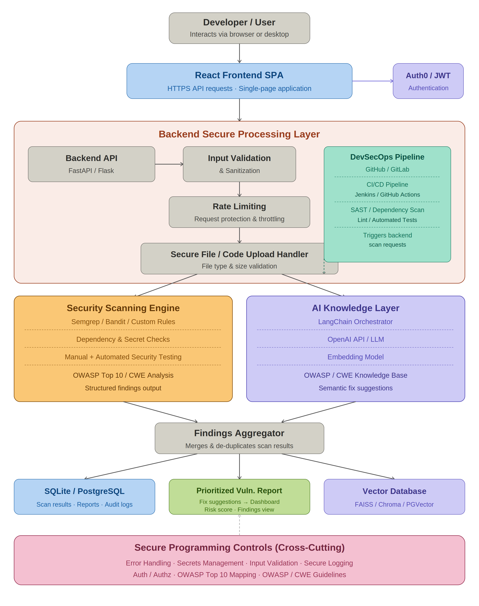

# Secure AI Programming Assistant for Vulnerability Detection and Secure Code Guidance

## Overview

Secure AI Programming Assistant is a full-stack web application designed to help developers write more secure software. The platform allows users to upload or paste source code, which is then analyzed using industry-standard vulnerability scanning tools. By leveraging Retrieval-Augmented Generation (RAG) and Large Language Models (LLMs), the system provides intelligent, context-aware explanations and secure coding guidance for detected vulnerabilities.

The goal of the system is not only to identify security issues, but also to educate developers by providing understandable remediation suggestions and best practices aligned with modern secure software development principles.

---

## System Architecture



---

## Purpose & Background

Modern software systems face increasing cybersecurity threats, while many developers lack the tools or expertise required to identify and remediate vulnerabilities early in the development lifecycle.

This project bridges that gap by combining:

- Automated static security analysis
- AI-assisted vulnerability explanations
- Secure coding recommendations
- Retrieval-Augmented Generation (RAG)
- Secure software engineering principles

The platform integrates security scanning tools such as Semgrep and Bandit with a curated security knowledge base and OpenAI-powered language models via LangChain.

Rather than simply reporting vulnerabilities, the system explains:
- Why the issue is dangerous
- Which secure coding principles are violated
- How developers can securely remediate the issue
- References to OWASP and CWE standards

The system itself is also designed following secure programming principles, including:
- JWT-based authentication
- Secure file handling
- API validation
- Logging and audit support
- Dockerized deployment
- DevSecOps workflows

---

# Features

- Secure user authentication using JWT
- Source code upload and manual code input
- Automated vulnerability scanning
- AI-generated secure coding explanations
- OWASP and CWE aligned remediation guidance
- Retrieval-Augmented Generation (RAG) support
- Scan result history and storage
- Dockerized deployment
- CI/CD pipeline integration
- REST API architecture
- Responsive frontend interface

---

# Technology Stack

| Layer | Technologies |
|---|---|
| Frontend | React, Vite, Tailwind CSS |
| Backend | FastAPI, Python |
| Authentication | JWT |
| Security Scanning | Semgrep, Bandit, Secret Detection |
| AI & RAG | LangChain, OpenAI API, Vector Database |
| Database | SQLite / PostgreSQL |
| DevOps | Docker, GitHub Actions, Jenkins |
| API Documentation | Swagger/OpenAPI |

---

# How the Tech Stack is Used

## Frontend (React + Vite)

Provides a modern and responsive user interface for:
- Uploading source code
- Viewing vulnerability reports
- Displaying AI-generated explanations
- Managing authentication and sessions

The frontend communicates with the backend through secure REST APIs.

---

## Backend (FastAPI)

The backend exposes secure REST endpoints for:
- Authentication
- File uploads
- Vulnerability scanning
- AI explanation generation
- Scan result management

It orchestrates the scanning pipeline and AI workflows while maintaining secure communication using JWT authentication.

---

## Authentication (JWT)

JWT-based authentication ensures:
- Secure user login
- Protected API endpoints
- User-specific scan access
- Session management

---

## Security Scanning

The system integrates multiple security scanning tools:

### Semgrep
Detects:
- Insecure coding patterns
- OWASP-related vulnerabilities
- Common programming mistakes

### Bandit
Performs Python-specific static security analysis.

### Secret Detection
Identifies:
- Hardcoded credentials
- API keys
- Sensitive secrets

---

## AI & Retrieval-Augmented Generation (RAG)

The AI layer uses:
- LangChain
- OpenAI APIs
- Vector databases
- Curated security knowledge bases

This allows the system to generate:
- Context-aware vulnerability explanations
- Secure remediation guidance
- Human-readable security education

The RAG pipeline combines:
1. Scan findings
2. Security documentation
3. OWASP references
4. CWE references
5. LLM reasoning

---

## Database Layer

SQLite or PostgreSQL is used to store:
- User information
- Scan history
- Vulnerability results
- AI-generated explanations
- Vector embeddings

---

## DevSecOps Integration

GitHub Actions and Jenkins are used for:
- Automated testing
- Security validation
- Linting
- CI/CD workflows
- Dockerized deployment automation

---

# Project Folder Structure

```bash
secure-ai-assistant/
│
├── backend/
│   ├── app/
│   │   ├── api/                # API route definitions
│   │   ├── core/               # Config, database, security, logging
│   │   ├── models/             # SQLAlchemy models
│   │   ├── rag/                # RAG pipeline logic
│   │   ├── scanners/           # Scanner integrations
│   │   ├── schemas/            # Pydantic schemas
│   │   ├── security/           # Security utilities
│   │   ├── services/           # Business logic
│   │   └── knowledge_base/     # Security knowledge files
│   │
│   ├── tests/                  # Backend tests
│   ├── uploads/                # Temporary uploaded files
│   ├── vectorstore/            # Vector database storage
│   └── requirements.txt
│
├── frontend/
│   ├── public/
│   ├── src/
│   │   ├── components/
│   │   ├── context/
│   │   ├── hooks/
│   │   ├── pages/
│   │   ├── services/
│   │   └── utils/
│   │
│   ├── index.html
│   ├── package.json
│   └── vite.config.js
│
├── docs/
├── .github/workflows/
└── README.md
```

---

# System Workflow

1. User uploads or pastes source code through the frontend.
2. Backend securely processes the request.
3. Security scanners analyze the code.
4. Vulnerabilities and insecure patterns are detected.
5. Results are stored in the database.
6. RAG retrieves relevant security knowledge.
7. OpenAI generates context-aware explanations.
8. Frontend displays vulnerabilities and remediation guidance.

---

# Getting Started

## Backend Setup

```bash
cd backend

python -m venv venv

# Activate virtual environment

# Windows
venv\Scripts\activate

# Linux / macOS
source venv/bin/activate

pip install -r requirements.txt

uvicorn app.main:app --reload
```

Backend runs on:
```txt
http://127.0.0.1:8000
```

Swagger API Docs:
```txt
http://127.0.0.1:8000/docs
```

---

## Frontend Setup

```bash
cd frontend

npm install

npm run dev
```

Frontend runs on:
```txt
http://localhost:5173
```

---

# Docker Setup (Recommended)

## Build and Run

```bash
docker compose up --build
```

This starts:
- Frontend container
- Backend container
- Database services (if configured)

---

## Access the Application

| Service | URL |
|---|---|
| Frontend | http://localhost:5173 |
| Backend API | http://localhost:8000 |
| Swagger Docs | http://127.0.0.1:8000/docs |

---

## Environment Variables

### Backend

Copy:
```bash
.env.example
```

to:
```bash
.env
```

Then configure:
- OpenAI API keys
- Database credentials
- JWT secrets

---

### Frontend

Ensure:
```bash
VITE_API_BASE_URL
```

is properly configured inside:
```bash
frontend/.env
```

---

## Stop Containers

```bash
docker compose down
```

---

# Security Considerations

This project follows secure programming principles including:
- Input validation
- Secure authentication
- Secure file handling
- Principle of least privilege
- Static security analysis
- Dependency isolation with Docker
- API protection
- Error handling and logging

---

# Future Improvements

Potential future enhancements include:
- Multi-language vulnerability support
- Real-time collaborative scanning
- Advanced AI remediation suggestions
- Cloud-native deployment
- Kubernetes integration
- CI/CD security gates
- Fine-tuned security LLMs
- User dashboards and analytics

---

# Contributing

Contributions are welcome.

Please:
1. Fork the repository
2. Create a feature branch
3. Commit your changes
4. Open a pull request

For major changes, please open an issue first to discuss the proposed improvements.

---

# License

This project is intended for educational and research purposes.

---
