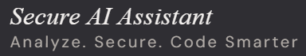

# Secure AI Programming Assistant for Vulnerability Detection and Secure Code Guidance

## Overview

Secure AI Programming Assistant is a full-stack web application designed to help developers write more secure code. The platform allows users to upload or paste their source code, which is then scanned for vulnerabilities using industry-standard tools. Leveraging advanced AI (Retrieval-Augmented Generation, or RAG), the system provides tailored, context-aware secure coding guidance and explanations for detected issues.

## Purpose & Background

Modern software development faces increasing security threats, and many developers lack the resources or expertise to identify and remediate vulnerabilities early. This project bridges that gap by combining automated static analysis tools with AI-driven explanations and recommendations, making secure coding accessible and actionable for all developers.

The assistant integrates traditional security scanners (like Semgrep and Bandit) with a knowledge base and LLMs (via LangChain and OpenAI), providing not just detection but also education and remediation advice. The system is designed with security best practices in mind, including robust authentication, secure file handling, and audit logging.

## How the Tech Stack is Used

- **Frontend (React + Vite):**  
	Provides a modern, responsive UI for uploading code, viewing scan results, and interacting with AI-generated explanations. Handles authentication and communicates with the backend via REST APIs.

- **Backend (FastAPI):**  
	Exposes secure REST endpoints for authentication, file upload, scanning, and AI guidance. Manages user sessions with JWT and orchestrates the scanning and AI explanation workflows.

- **Authentication (JWT):**  
	Ensures only authorized users can access sensitive features and their own scan results.

- **Security Scanning (Semgrep, Bandit, Secret Detection):**  
	Runs static analysis on uploaded code to detect common vulnerabilities, insecure patterns, and secrets.

- **AI/RAG (LangChain, Vector Database, OpenAI API):**  
	Uses retrieval-augmented generation to provide context-aware, human-readable explanations and secure coding advice, referencing both the code and a curated knowledge base.

- **Database (SQLite/PostgreSQL):**  
	Stores user data, scan results, explanations, and knowledge base vectors.

- **DevSecOps (GitHub Actions/Jenkins):**  
	Automates testing, linting, and deployment to ensure code quality and security throughout the development lifecycle.

## Project Folder Structure

```
secure-ai-assistant/
│
├── backend/
│   ├── app/
│   │   ├── api/                # API route definitions and dependencies
│   │   ├── core/               # Core config, security, database, logging
│   │   ├── models/             # SQLAlchemy models for users, scans, etc.
│   │   ├── rag/                # RAG logic: knowledge loader, retriever, prompt builder
│   │   ├── scanners/           # Security scanner integrations (Semgrep, Bandit, etc.)
│   │   ├── schemas/            # Pydantic schemas for API validation
│   │   ├── security/           # Security utilities
│   │   ├── services/           # Business logic (auth, scan, explanation, submission)
│   │   └── knowledge_base/     # Curated security knowledge files
│   ├── tests/                  # Backend unit and integration tests
│   ├── uploads/                # Temporary storage for uploaded code files
│   ├── vectorstore/            # Vector database for RAG
│   └── requirements.txt        # Python dependencies
│
├── frontend/
│   ├── public/                 # Static assets
│   ├── src/
│   │   ├── components/         # Reusable React components
│   │   ├── context/            # React context providers (e.g., Auth)
│   │   ├── hooks/              # Custom React hooks
│   │   ├── pages/              # Page-level React components
│   │   ├── services/           # API service wrappers
│   │   └── utils/              # Utility functions
│   ├── index.html
│   ├── package.json
│   └── ... (Vite/React config files)
│
├── docs/                       # Project documentation
├── .github/workflows/          # CI/CD workflows
└── README.md                   # Project overview and setup instructions
```

## How This Works

1. **User uploads or pastesee code via the frontend.**
2. **Backend scans the code** using Semgrep, Bandit, and secret detection tools.
3. **Scan results are stored** and associated with the user.
4. **For each vulnerability,** the backend uses RAG (LangChain + OpenAI + knowledge base) to generate a detailed, context-aware explanation and secure coding advice.
5. **Frontend displays results** and AI guidance, helping users understand and fix vulnerabilities.

## Getting Started

### Backend

```bash
cd backend
python -m venv venv
# activate venv
pip install -r requirements.txt
uvicorn app.main:app --reload
```

### Frontend

```bash
cd frontend
npm install
npm run dev
```

## Docker Setup (Quick Start)

Follow these simple steps to run the entire stack using Docker:

1. **Build and start all services:**
   ```sh
   docker compose up --build
   ```
   This will build and start both the backend and frontend containers.

2. **Access the application:**
   - Frontend: http://localhost:5173
   - Backend API: http://localhost:8000

3. **Environment variables:**
   - Backend: Copy `.env.example` to `.env` and fill in your secrets (API keys, DB, etc).
   - Frontend: Ensure `.env` exists with `VITE_API_BASE_URL` set (see frontend/.env.example).

4. **Stopping containers:**
   ```sh
   docker compose down
   ```

**Note:**
- Make sure Docker is installed and running on your system.
- The backend will use SQLite by default unless you configure PostgreSQL in your `.env` file.
- For production, review and secure all environment variables and secrets.

## Contributing

Contributions are welcome! Please see the `docs/` folder and open issues or pull requests as needed.